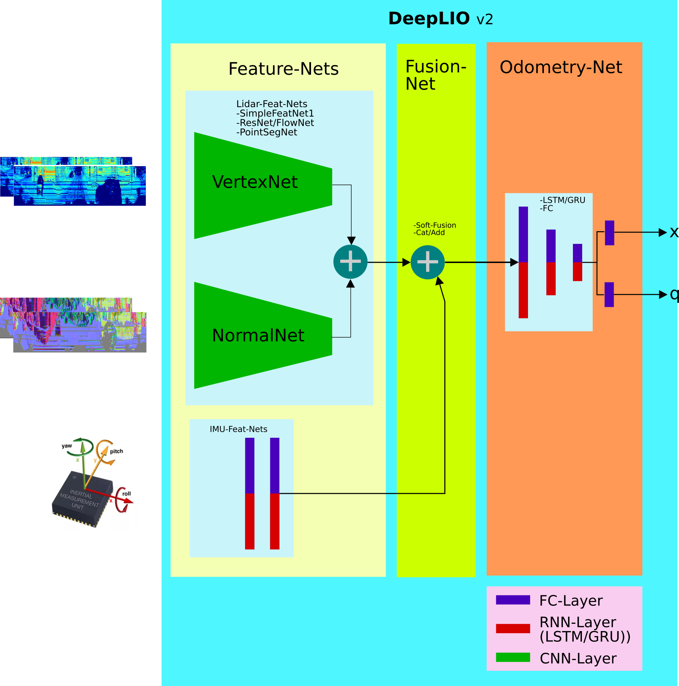
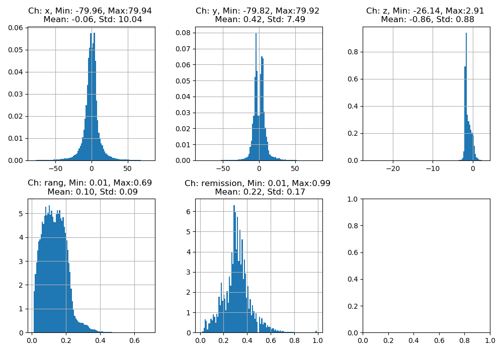

# DeepLIO
__Deep Lidar Inertial Odometry__


1. Intorduction

DeepLIO is an deep learning based odometry estimation by fusing lidar and IMU. 

Cloning deeplio
```
git clone https://github.com/ArashJavan/DeepLIO.git
cd DeepLIO
```


### __1.1 Dependencies__

Following packages should be already installed, before you can start using deeplio.
- pytorch (> v1.4)
- tensorboard 
- [pytorch-model-summary](https://pypi.org/project/pytorch-model-summary/)
- tqdm (optional)
- open3d (optinal)

### __1.2 Preparing the KITTI Dataset__

__Downloading KITTI__

In this project the synced and unsyced (extract) version of the KITTI dataset is used.
From unsynced (extract) data we only need the IMu measurments and from the synced data the lidar frames and the ground truth. 
So if you want to reduce the storage space, you can safely remove the images folder and also the lidar frames from the unsyced versoin.
Eithter you download the datasets by yourself or you can also  run the _download_kitti_raw.sh_ script to download the KITTI raw sequences.

__Note__: You will need at least 300 GB free sapce on your hard drive.

```
$ mkdir -p datasets/KITTI/sync
$ download_kitti_raw.sh datasets/KITTI  sync

$ mkdir -p datasets/KITTI/extract
$ download_kitti_raw.sh datasets/KITTI  extract
```
Now wait till download is completed. Well it will take a long long time so go get some coffee :)

At the end you will find all sequences extracted under KITTI folder
```
KITTI
|
 extract|
        |> 2011_09_30
        |-> 2011_09_30_drive_0016_extract
            |-> image0 .. imahe3
            |->oxts
            |->velodyne_points
        .
        .
        .
    |-> 2011_10_03
        |-> 2011_09_03_drive_0027_extract
    .
    .
    .
 sync|
    .
    .
    .
```

### __1.3 DeepLIO Architecture__
DeepLIO is made completely modular and configurable, e.g. every part and module can be combined with other modules to build
the whole network architecture. As you can see from the following figure, there are four main modules.
- __LiDAR-Feature-Nets__:
This module is responsible for extracting (learn) and encoding the LiDAR frames which are first transformed by spherical projection.
- __IMU-Feature-Nets__:
This module is responsible for extracting (learn) and encoding the IMU measurements, which consists of linear acceleration and 
 angular velocity (dim=6).
- __Fusion-Net__:
This module is responsible for fusing the features extract fom LiDAR and IMU.
- __Odometry-Net__:
At least in this module the fused features are used to learn the hidden state, which shall explain the odometry information 
encoded in these features.



#### __1.3.1 LiDAR-Feature-Nets__
The inputs to this module are the projected LiDAR frames and their normal images, which in the current configuration is built by stacking two remission (intensity) and
depth channels together. The module itself is made of an arbitrary Convolutional Neural Network (CNN). These networks are 
implemented as a [siamese netowrk](https://github.com/ArashJavan/DeepLIO/blob/master/deeplio/models/nets/lidar_feat_nets.py#L135).
At this point in time there are four CNN-Architectures implemented:

1.  [FlowNet-Feature-Net]

__TODO__ adding link to flownet here.

2.  [ResNet-Feature-Net]

__TODO__ adding link to resnet here.

3.  [Simple-Feature-Net]

4. [PointSeg-Feature-Net](https://github.com/ArashJavan/DeepLIO/blob/master/deeplio/models/nets/lidar_feat_nets.py#L43)
This network is the implementation of the more demanding [PointSeg Netowrk](https://github.com/ArashJavan/PointSeg). 
the network it self is made of three functional layers, the so called Fire layers,  squeeze reweighting
layer and enlargement layer. An interested reader may find more information about each of those layers in the original
[PointSeg paper](https://arxiv.org/pdf/1807.06288.pdf).

All the above listed networks can be found and configured in the configuration file:

```yaml
### Lidar Feature Netowrks ###########################
# feature network simple0 with conv layers

# feature network pointseg
lidar-feat-pointseg:  # pointseg feature
  dropout: 0.1
  classes: ['unknown', 'object']
  bypass: "simple"
  fusion: add # [cat, sub, add]
  part: "encoder" # [encoder]

lidar-feat-flownet:
  dropout: 0.
  fusion: add # [cat, sub, add]

lidar-feat-resnet:
  dropout: 0.25
  fusion: add # [cat, sub, add]

# feature network simple0 with bypassed conv layers
lidar-feat-simple-1:
  dropout: 0.25
  fusion: add # [cat, sub, add]
  bypass: false
```

With the keyword _fusion_ you can define, if the both threads of the siamese network should be concatenated together or subtracted.
Please note that by subtracting you will have the half number of feature as by concatenating. 

#### __1.3.3 IMU-Feature-Nets__
The inputs to this modules are sequences of the IMU measurements. Basically any kind of Fully Connected (FC) Network
can be configured here. Since the IMU measurements are also time series it is quit appealing to handle them 
with an RNN based network. For this reason both of these networks - FC and RNN (LSTM, GRU), are also implemented 
in the  [IMU-Module](https://github.com/ArashJavan/DeepLIO/blob/master/deeplio/models/nets/imu_feat_nets.py).
Again you can freely configure each network in the config-file section:

```yaml
### IMU Feature Netowrks ###########################
# IMU Feature Netowrks
imu-feat-fc:  # FC
  input-size: 6  # !fixed! do not chanage
  hidden-size: [1024, 512, 256]
  dropout: 0.

imu-feat-rnn: # RNN
  type: "lstm"
  input-size: 6  # !fixed! do not chanage
  hidden-size: 128
  num-layers: 2
  bidirectional: true
  dropout: 0.
```

Please note that the networks are build dynamically, e.g. you can change number of hidden layers an other stuff as required.

#### __1.3.2 Fusion-Layer__
After we have encoded the features in each sensory information by passing them through each IMU and LiDAR Network, 
we should some how fusion them together for the task of odometry inference. One classical approach may be using some kind of 
filter like for example Kalman-Filter, but since we want a fully differentiable system, we should integrate this part also 
in the network. One simple procedure would be just concatenating them together, or use another network to learn the 
correlation between those features, as in attention based networks. For now only concatenating procedure is implemented.

```yaml
### Fusion-Layer for DeepLIO Net ###########################
fusion-layer:
  type: "cat" # [cat, soft-fusion]
```

#### __1.3.4 Odometry-Feature-Nets__
This layer should learn how to extract information needed for the task fo odometery inference from the fused features.
Since odometry inference can be  typically seen as an inference in a time series, both RNN-based an FC-based networks 
can be used here. Like in IMU-Features you can configure the odom-feat-network as you need.

```yaml
### Odometry Feature Netowrks ###########################
# odometry feature network with fully connected layers
odom-feat-fc:
  size: [256]
  dropout: 0.

# odometry feature network with rnn-layers
odom-feat-rnn:
  type: "lstm"
  hidden-size: 512
  num-layers: 2
  bidirectional: true
  dropout: 0.
```
 
### __1.4 Configuring DeepLIO__
As mentioned before you can configure each module of the network as you need, e.g. you can also forego some modules if you
want.  

```yaml
### DeepLIO Network ##############################
deeplio:
  dropout: 0.25
  pretrained: false
  model-path: ""
  lidar-feat-net:
    name: "lidar-feat-simple-1"
    pretrained: false
    model-path: ""
  imu-feat-net:
    name: "imu-feat-rnn"
    pretrained: false
    model-path: ""
  odom-feat-net:
    name: "odom-feat-fc"
    pretrained: false
    model-path: ""
  fusion-net: "fusion-layer"
```

You can choose between different network implementations by just replacing the name of the desired network.  


#### __1.4.1 DeepIO__
__Deep Inertial Odometry__
You can configure the network in a way that it only uses IMU measurements for odometry prediction. You do it 
just by commenting out '#' the name of all other modules, as below:

```yaml
 ### DeepLIO Network ##############################
deeplio:
  dropout: 0.25
  pretrained: false
  model-path: ""
  lidar-feat-net:
    name: # "lidar-feat-simple-1" # See the name is commented out
    pretrained: false
    model-path: ""
  imu-feat-net:
    name: "imu-feat-rnn"
    pretrained: false
    model-path: ""
  odom-feat-net:
    name: # "odom-feat-fc" # See the name is commented out
    pretrained: false
    model-path: ""
  fusion-net: "fusion-layer"
```

Please also note that you can for example have IMU and Odometry module by just commenting Lidar-Module out!

#### __1.4.2 DeepLO__ 
__Deep LiDAR Odometry__
In the same way you can configure the network in a way that it only uses Lidar measurements for odometry prediction. You do it 
just by commenting out '#' the name of all other modules, as below:

```yaml
 ### DeepLIO Network ##############################
deeplio:
  dropout: 0.25
  pretrained: false
  model-path: ""
  lidar-feat-net:
    name: "lidar-feat-simple-1"
    pretrained: false
    model-path: ""
  imu-feat-net:
    name: "imu-feat-rnn"  # See the name is commented out
    pretrained: false
    model-path: ""
  odom-feat-net:
    name: # "odom-feat-fc" # See the name is commented out
    pretrained: false
    model-path: ""
  fusion-net: "fusion-layer"
```

Please also note that you can for example have LiDAR and Odometry module by just commenting IMU-Module out!
As you can easily guess you will get the whole __DeepLIO__ netowrk by naming all the modules you want in the network.  


### __1.5 Data Normalization__
The inputs to the LiDAR-Feat-Nets are as mentioned before the projected frame, consisting of two remission and intensity channels.
As you can imagine they do not have the same scale, for this reason they should be normalized before we pass them to the network.
The same is true for IMU-measurments. Mean and standard deviation of each inputs to the netowrk 
is  calculated by [Mean-Std-Script](https://github.com/ArashJavan/DeepLIO/blob/master/scripts/mean_std_dataset.py).
For the KITTI dataset the values are already incorporated in the config-file.
```yaml
    # channesl: x, y, z, range(x,y,z), remissions)
    mean-image: [-0.05815, 0.4165, -0.8585, 0.1029, 0.2164]
    std-image: [10.0366, 7.4936, 0.8761, 0.0857, 0.1740]
    mean-imu: [-0.0635, 0.186, 9.7966, 0., 0.0005, 0.0082]
    std-imu: [0.8525, 0.9516, 0.3401, 0.0198, 0.02204, 0.1383]
```

__Note__: In this work we use in the computer vision community more popular inverse depth representation
insted of depth values directly.



### __1.6 Training DeepLIO___
You can train the network by first preparing the KITTI datset as explained before, then performing the required configurations
in the config-file depending on your needs and at least starting the training by executing:

```shell script
python deeplio/train.py
``` 
or 
```shell script
python deeplio/train.py --lr 0.01 --weight-decay 0.0001 -b 32 --epochs 100 -j 6 --device cuda --print-freq 10 --lr-decay 20
``` 

For each traning instance one folder with the current timestampm will be created and the outputs of the netowork are all saved in there.
The Ouputs are:
- Checkpoints. 
- Logfile.
- Tensorboard logfile.


### Citation

If you use this package for your research, a footnote with the link to this repository is appreciated: https://github.com/ArashJavan/DeepLIO.
For citation with BibTeX:

```
@misc{deeplio2020,
  title={DeepLIO: Deep Lidar Inertial Odometry.},
  author={Javanmard-Gh., Arash},
  howpublished={\url{https://github.com/ArashJavan/DeepLIO}},
  year={2020}
}

```
