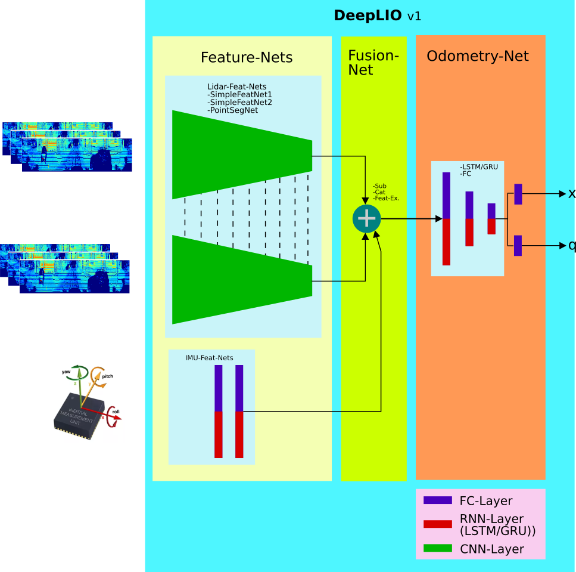

# DeepLIO
__Deep Lidar Inertial Odometry__

#### !!!This repo is under heavy development at the moment!!!

1. Intorduction

DeepLIO is an deep learning based odometry estimation by fusing lidar and IMU. 

Cloning deeplio
```
git clone https://github.com/ArashJavan/DeepLIO.git
cd DeepLIO
```


### __1.1 Dependencies__

Following packages should be already installed, before you can start using deeplio.
- pytorch 
- tqdm (optional)
- open3d (optinal)

### __1.2 Preparing the KITTI Dataset__

__Downloading KITTI__

In this project the synced and unsyced (extract) version of the KITTI dataset is used.
From unsynced (extract) data we only need the IMu measurments and from the synced data the lidar frames and the ground truth. 
So if you want to reduce the storage space, you can safely remove the images folder and also the lidar frames from the unsyced versoin.
Eithter you download the datasets by yourself or you can also  run the _download_kitti_raw.sh_ script to download the KITTI raw sequences.

__Note__: You will need at least 300 GB free sapce on your hard drive.

```
$ mkdir -p datasets/KITTI/sync
$ download_kitti_raw.sh datasets/KITTI  sync

$ mkdir -p datasets/KITTI/extract
$ download_kitti_raw.sh datasets/KITTI  extract
```
Now wait till download is completed. Well it will take a long long time so go get some coffee :)

At the end you will find all sequences extracted under KITTI folder
```
KITTI
|
 extract|
        |> 2011_09_30
        |-> 2011_09_30_drive_0016_extract
            |-> image0 .. imahe3
            |->oxts
            |->velodyne_points
        .
        .
        .
    |-> 2011_10_03
        |-> 2011_09_03_drive_0027_extract
    .
    .
    .
 sync|
    .
    .
    .
```

### __1.3 DeepLIO Architecture__
DeepLIO is made completely modular and configurable, e.g. every part and module can be combined with other modules to build
the whole network architecture. As you can see from the following figure, there are four main modules.
- __LiDAR-Feature-Nets__:
This module is responsible for extracting (learn) and encoding the LiDAR frames which are first transformed by spherical projection.
- __IMU-Feature-Nets__:
This module is responsible for extracting (learn) and encoding the IMU measurements, which consists of linear acceleration and 
 angular velocity (dim=6).
- __Fusion-Net__:
This module is responsible for fusing the features extract fom LiDAR and IMU.
- __Odometry-Net__:
At least in this module the fused features are used to learn the hidden state, which shall explain the odometry information 
encoded in these features.



#### __1.3.1 LiDAR-Feature-Nets__
The input to this module are the projected LiDAR frames, which in the current configuration is built by stacking two remission (intensity) and
depth channels together. The module itself is made of an arbitrary Convolutional Neural Network (CNN). These networks are 
implemented as a [siamese netowrk](https://github.com/ArashJavan/DeepLIO/blob/master/deeplio/models/nets/lidar_feat_nets.py#L135)
with shared parameters. At this point in time there are three CNN-Architectures implemented:
1.  [Simple-Feature-Net-0](https://github.com/ArashJavan/DeepLIO/blob/master/deeplio/models/nets/lidar_feat_nets.py#L116)
This network is make of standard CNN-Layers which are stacked together.

 

  


